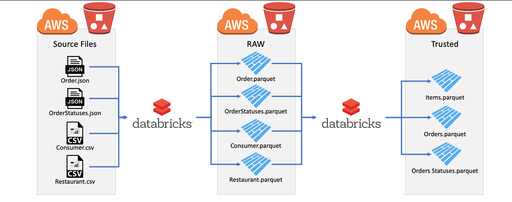
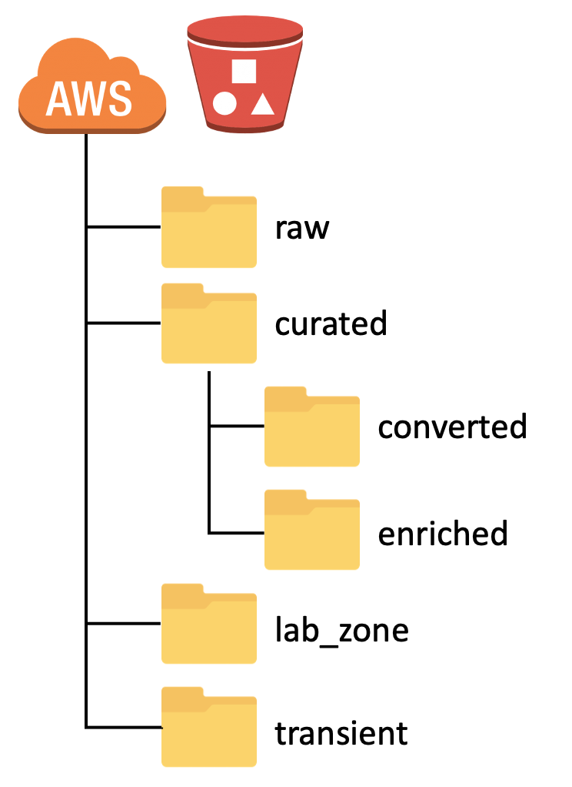

# iFood Data Architect Test

O objetivo desse projeto é resolver o case apresentado seguindo as diretrizes abaixo:

## Problema Apresentado
Process semi-structured data and build a datalake that provides efficient storage and performance. The datalake must be organized in the following 2 layers:
* raw layer: Datasets must have the same schema as the source, but support fast structured data reading
* trusted layer: datamarts as required by the analysis team

### Requirements

* Source files:
  * Order: s3://ifood-data-architect-test-source/order.json.gz
  * Order Statuses: s3://ifood-data-architect-test-source/status.json.gz
  * Restaurant: s3://ifood-data-architect-test-source/restaurant.csv.gz
  * Consumer: s3://ifood-data-architect-test-source/consumer.csv.gz 
* Raw Layer (same schema from the source):
  * Order dataset.
  * Order Statuses dataset.
  * Restaurant dataset.
  * Consumer dataset.
* Trusted Layer:
  * Order dataset -  one line per order with all data from order, consumer, restaurant and the LAST status from order statuses dataset. To help analysis, it would be a nice to have: data partitioned on the restaurant LOCAL date.
  * Order Items dataset - easy to read dataset with one-to-many relationship with Order dataset. Must contain all data from _order_ items column.
  * Order statuses - Dataset containing one line per order with the timestamp for each registered event: CONCLUDED, REGISTERED, CANCELLED, PLACED.
* For the trusted layer, anonymize any sensitive data.
* At the end of each ETL, use any appropriated methods to validate your data.
* Read performance, watch out for small files and skewed data.

### Non functional requirements
* Data volume increases each day. All ETLs must be built to be scalable.
* Use any data storage you feel comfortable to.
* Document your solution.

## Resolução

### Arquitetura Sugerida

Seguindo a necessidade de armazenamento dos dados, de escalabidade e facilidade de leitura, a arquitetura abaixo é a sugerida:

* Como pode ser observado na imagem, como os arquivos estão sendo retirados de um S3 da Amazon, resolvi manter a mesma estrutura cloud para o armazenamento dos arquivos e construção do Data Lake, porém seria possível implementar a mesma ideia em outras plataformas cloud, como por exemplo, utilizando o Azure Data Lake.

* Além disso, os arquivos Trusted, dependendo da estrutura da empresa com relação a ferramentas de visualização de dados, podem ser armazenado também em um Data Warehouse, no caso da Amazon utilizando o Redshift e no caso da Azure utilizando o Azure Data Warehouse.

* O armazenamento dos arquivos em formato parquet foi utilizada pela necessidade de estruturação dos dados e pelo formato ser otimizado para leitura. Além disso, a maioria das ferramentas de visualização conseguem utilizar o formato para criação de dashboards e análises.

* Todas as ferramentas sugeridas são facilmente escaláveis e conseguem ser integradas com outros sistemas, como por exemplo, o Databricks que consegue ler arquivos de diversas fontes e manipulá-los utilizando diversas linguagens de programação.

* Outras ferramentas de ETL podem ser utilizadas, como o Amazon Glue ou o Azure Data Factory, dependendo da necessidade e recursos da plataforma.

### Estrutura do Data Lake

Seguindo o modelo sugerido construído utilizando as ferramentas da Amazon, teríamos a seguinte distribuição de pastas dentro do bucket no Amazon S3:

